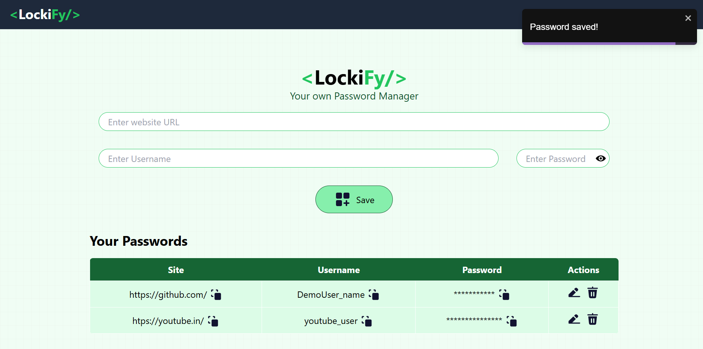

# 📂 LockiFy
A secure, user-friendly password management system built using React, Node.js, Express, and MongoDB. This project aims to provide users with a simple, yet effective way to store and manage their login credentials securely.

## 🔐 Features
* Secure Credential Storage: Usernames and passwords are stored securely in MongoDB.
* Password Masking: Passwords are displayed in a masked (*** format) for privacy.
* Easy Copy Functionality: Copy website URL, username, or password to the clipboard with one click.
* Toast Notifications: Get real-time success or error feedback when performing actions.
* Cybersecurity Practices: The application incorporates essential principles of data protection and security.

## 🛠️ Tech Stack
* Frontend: React (with hooks and functional components)
* Backend: Node.js, Express.js
* Database: MongoDB (NoSQL)

## 📷 Screenshots


## 📦 Installation
1. Clone the repository:
```
git clone https://github.com/Het-Kotadiya/Lockify.git
cd LockiFy
```
2. Install dependencies
```
npm install
```
4. Set up the environment variables
    Create a .env file in the backend directory and add the following:
```
MONGO_URI=your_mongodb_connection_string
PORT=5000
```
5. Run the application:
```
npm run dev
```

## 🚀 Usage
1. Add Credentials: Enter the website URL, username, and password.
2. View Credentials: View stored credentials, where passwords are masked for security.
3. Copy Functionality: Click the copy buttons to copy URL, username, or password.

## 🔒 Security Practices
* Data Protection: User credentials are stored securely in a MongoDB database.
* Password Masking: Prevents passwords from being visible on the main screen.